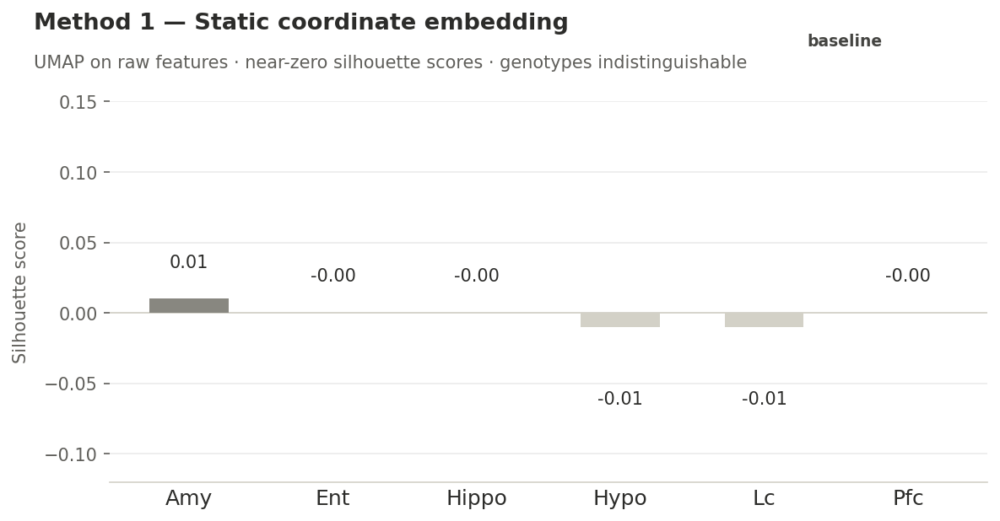
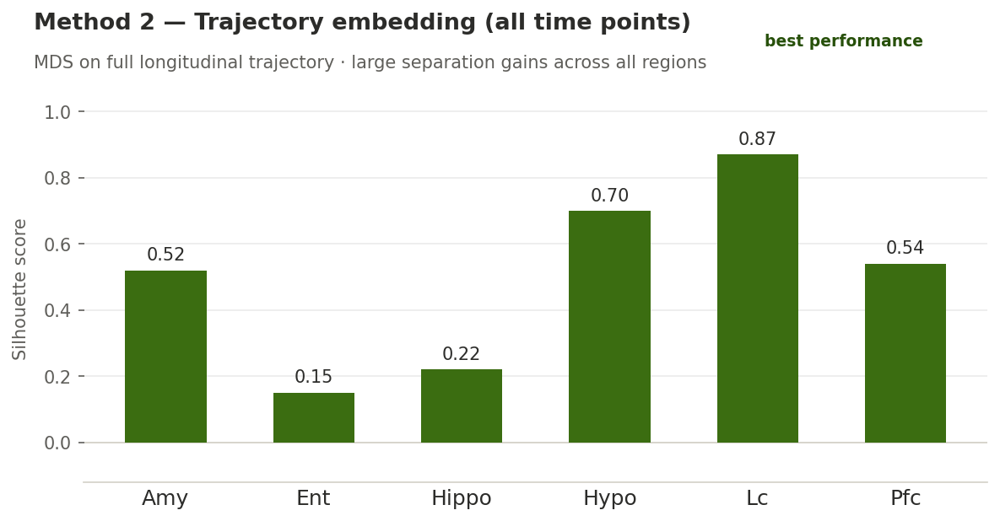
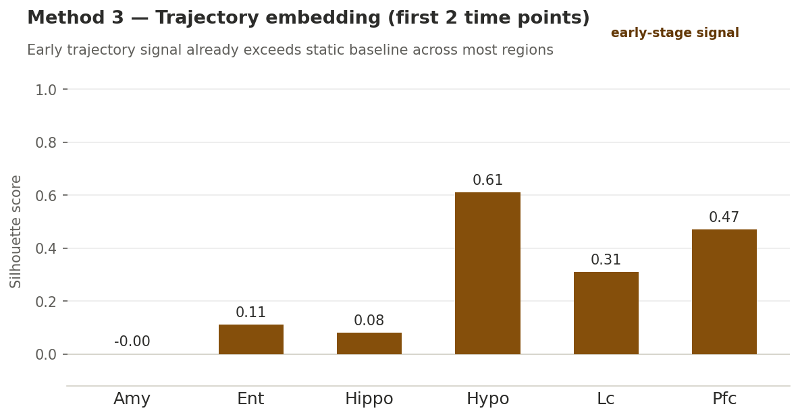

# Dynamic Trajectory Embedding for Genotype Classification in Neurodegeneration

> **Status:** Work in progress — code not yet released. This repository currently presents results and methodology overview only.

---

## Overview

This project investigates whether capturing the **dynamics** of cellular behavior over time — rather than static snapshots — can substantially improve the ability to distinguish between disease-relevant genotypes across multiple brain regions.

Three mouse genotypes are compared: **wild type (WT)**, **APP** (amyloid precursor protein model), and **TAU** (tauopathy model), representing different stages and mechanisms of neurodegeneration. The central question is: *does trajectory information carry discriminative signal that static coordinates cannot?*

The answer, across all six brain regions tested, is an emphatic yes.

---

## Brain Regions Analyzed

| Abbreviation | Region |
|---|---|
| Amy | Amygdala |
| Ent | Entorhinal cortex |
| Hippo | Hippocampus |
| Hypo | Hypothalamus |
| Lc | Locus coeruleus |
| Pfc | Prefrontal cortex |

---

## Methods Compared

### Method 1 — Static embedding (baseline)
Cells are embedded using their coordinate features at a single time point. UMAP is applied to visualize and evaluate cluster structure. This represents the conventional, snapshot-based approach.

### Method 2 — Trajectory embedding (all time points)
Rather than using static positions, cells are represented by features derived from their **full longitudinal trajectory** across all available time points. A dimensionality reduction step (MDS) is applied and the resulting embedding is evaluated for genotype separability.

### Method 3 — Trajectory embedding (first two time points only)
The same trajectory-based approach as Method 2, but restricted to only the first two time points. This tests whether early longitudinal signal is sufficient for classification — a question with direct implications for early disease detection.

---

## Evaluation

Cluster quality is assessed using the **silhouette score**, which measures how well each point fits its own cluster relative to neighboring clusters. Scores range from −1 (misclassified) to +1 (well-separated). A score near 0 indicates overlapping or indistinguishable clusters.

---

## Results

### Silhouette scores by method and brain region

| Brain region | Static embedding | Trajectory (full) | Trajectory (2 time points) |
|---|---|---|---|
| Amygdala | 0.01 | **0.52** | −0.00 |
| Entorhinal cortex | −0.00 | **0.15** | 0.11 |
| Hippocampus | −0.00 | **0.22** | 0.08 |
| Hypothalamus | −0.01 | **0.70** | 0.61 |
| Locus coeruleus | −0.01 | **0.87** | 0.31 |
| Prefrontal cortex | −0.00 | **0.54** | 0.47 |
| **Average** | **~0.00** | **~0.50** | **~0.26** |

### Key findings

**Static embedding fails entirely.** Silhouette scores are effectively zero across all six regions, indicating that genotypes cannot be separated from static coordinate information alone. The three groups are indistinguishable in embedding space.

**Full trajectory embedding dramatically outperforms the baseline.** Incorporating the complete longitudinal trajectory yields an average silhouette score of ~0.50, with a peak of 0.87 in the locus coeruleus. This represents a qualitative shift — genotypes that were completely confounded in static space become cleanly separable when dynamics are encoded.

**Early trajectory signal is already informative.** Even with only the first two time points, the trajectory embedding achieves an average silhouette score of ~0.26 — far above the static baseline. Regions such as the hypothalamus (0.61) and prefrontal cortex (0.47) retain substantial separability with minimal longitudinal data. This suggests that disease-state information is encoded early in the trajectory and could in principle support earlier classification.

---

## Figures

### Figure 1 — Static embedding (UMAP)
*Embedding of raw static coordinates. Near-zero silhouette scores across all regions indicate that genotypes are not separable from positional features alone.*

### Figure 2 — Trajectory embedding, all time points (MDS)
*Embedding of full longitudinal trajectory features. Genotypes separate clearly in all six brain regions, with silhouette scores ranging from 0.15 to 0.87.*

### Figure 3 — Trajectory embedding, first two time points only (UMAP)
*Trajectory embedding restricted to the earliest observations. Meaningful separation is retained, particularly in the hypothalamus and prefrontal cortex, demonstrating that early dynamics carry predictive signal.*

---

## Implications

These results suggest that **the dynamics of cellular behavior are far more informative than static snapshots** for distinguishing between disease genotypes. The consistent improvement across all six brain regions — spanning cortical, limbic, and subcortical structures — indicates this is not a region-specific artifact but a robust property of the trajectory representation.

The partial time point experiment has particular translational relevance: if meaningful genotype separation can be achieved with limited longitudinal data, it may be possible to classify disease state or predict progression trajectory from early observations, before full structural changes manifest.

---

## Citation

> Work in progress. Please do not cite or reproduce without permission.

---

## Contact

For questions or collaboration inquiries, please open an issue or reach out directly.
